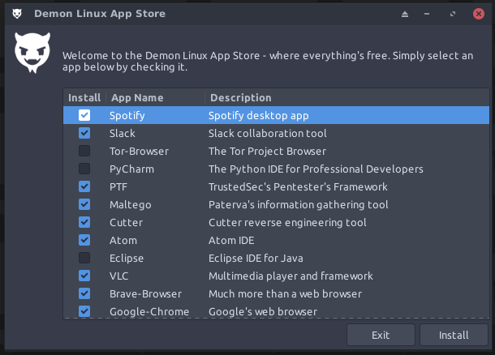
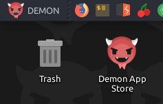

# Demon-Linux-App-Store
Finally, the Demon LINUX App Store is here! This, technically, should work with any Debian 10 distribution.
## The Store UI


## The Desktop Launcher


## Installation
To install, please run the ```./install-app-store.sh``` file.
