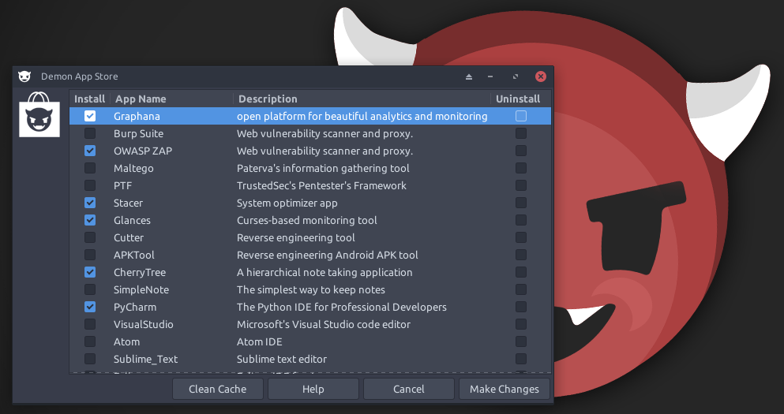

Finally, the Demon LINUX App Store is here! This, technically, should work with any Debian 10 distribution.
## The Store UI


## Self Maintaining
The Demon App Store will update itself in /appdev/ before each run. This is due to the ```demon-app-store-workflow.sh``` file which is stored in ```/usr/local/sbin/``` which holds all of the working code.

#### Dependencies
* wget
* awk, sed, grep
* apt
* git
* yad
* tail
* dpkg
* curl
* add-apt-repository
