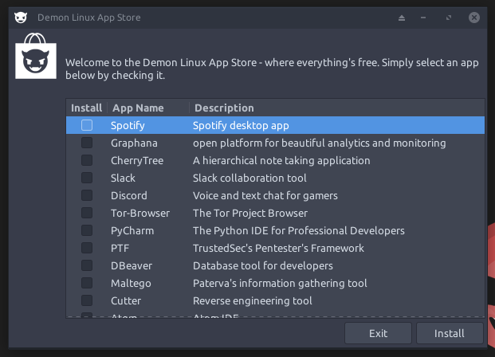

Finally, the Demon LINUX App Store is here! This, technically, should work with any Debian 10 distribution.
## The Store UI


## Self Maintaining
The Demon App Store will update itself in /appdev/ before each run.

## Installation
To install, please run the ```./install-app-store.sh``` file.
#### Dependencies
* wget
* awk, sed, grep
* apt
* git
* yad
* tail
* dpkg
* curl
* add-apt-repository
